# RideWise - Class Diagram Documentation

This document provides a comprehensive class diagram and relationship analysis of the RideWise system.

## 📊 Class Diagram (Mermaid)

```mermaid
classDiagram
    %% Model Classes
    class Rider {
        -String riderId
        -String name
        -String email
        -String phone
        -Location riderLocation
        +getRiderId() String
        +getName() String
        +getEmail() String
        +getPhone() String
        +getRiderLocation() Location
        +matchesSearchCriteria(String) boolean
        +display() void
        +displaySearchResult() void
    }

    class Driver {
        -String driverId
        -String name
        -String email
        -String phone
        -Location driverLocation
        -boolean isAvailable
        -int completedRidesCount
        +getDriverId() String
        +getName() String
        +isAvailable() boolean
        +getCompletedRidesCount() int
        +incrementCompletedRides() void
        +matchesSearchCriteria(String) boolean
        +display() void
        +displaySearchResult() void
    }

    class Ride {
        -String rideId
        -Rider rider
        -Driver driver
        -double distance
        -RideStatus rideStatus
        -VehicleType vehicleType
        +getRideId() String
        +getRider() Rider
        +getDriver() Driver
        +getDistance() double
        +getRideStatus() RideStatus
        +getVehicleType() VehicleType
        +matchesSearchCriteria(String) boolean
        +display() void
        +displaySearchResult() void
    }

    class FareReceipt {
        -String receiptId
        -String rideId
        -double amount
        -Instant generatedAt
        +getReceiptId() String
        +getRideId() String
        +getAmount() double
        +getGeneratedAt() Instant
        +matchesSearchCriteria(String) boolean
        +display() void
        +displaySearchResult() void
    }

    class Location {
        -double latitude
        -double longitude
        +getLatitude() double
        +getLongitude() double
        +calculateDistanceTo(Location) double
        +equals(Object) boolean
        +hashCode() int
        +toString() String
    }

    class RideStatus {
        <<enumeration>>
        REQUESTED
        ASSIGNED
        COMPLETED
        CANCELLED
    }

    class VehicleType {
        <<enumeration>>
        BIKE
        AUTO
        CAR
        BUS
    }

    %% Service Classes
    class RiderService {
        -DataStore~Rider~ riderStore
        +registerRider(Rider) void
        +getRider(String) Rider
        +updateRider(Rider) void
        +deleteRider(Rider) void
        +getAllRiders() List~Rider~
    }

    class DriverService {
        -DataStore~Driver~ driverStore
        +registerDriver(Driver) void
        +getDriver(String) Driver
        +updateDriver(Driver) void
        +deleteDriver(String) void
        +getAllDrivers() List~Driver~
        +getAvailableDrivers() List~Driver~
    }

    class RideService {
        -DataStore~Ride~ rideStore
        -DriverService driverService
        -RiderService riderService
        -FareCalculationStrategy fareCalculationStrategy
        -RideMatchingStrategy rideMatchingStrategy
        +requestRide(String, Location, Location, VehicleType) Ride
        +completeRide(String) FareReceipt
        +cancelRide(String) void
        +getRide(String) Ride
        +getAllRides() List~Ride~
    }

    %% Strategy Interfaces
    class RideMatchingStrategy {
        <<interface>>
        +findDriver(Rider, List~Driver~) Driver
    }

    class FareCalculationStrategy {
        <<interface>>
        +calculateFare(Ride) double
    }

    %% Strategy Implementations
    class NearestDriverStrategy {
        +findDriver(Rider, List~Driver~) Driver
    }

    class LeastActiveDriverStrategy {
        +findDriver(Rider, List~Driver~) Driver
    }

    class DefaultFareStrategy {
        -BIKE_BASE_RATE double
        -AUTO_BASE_RATE double
        -CAR_BASE_RATE double
        -BUS_BASE_RATE double
        +calculateFare(Ride) double
        -getBaseRateForVehicleType(VehicleType) double
    }

    class PeakHourFareStrategy {
        -BIKE_BASE_RATE double
        -AUTO_BASE_RATE double
        -CAR_BASE_RATE double
        -BUS_BASE_RATE double
        -PEAK_HOUR_MULTIPLIER double
        +calculateFare(Ride) double
        -getBaseRateForVehicleType(VehicleType) double
        -isPeakHour() boolean
    }

    %% Utility Classes
    class DataStore~T~ {
        -HashMap~String,T~ dataMap
        -ArrayList~T~ datalist
        +add(String, T) void
        +findById(String) T
        +update(String, T) void
        +delete(String) void
        +getAll() List~T~
        +size() int
        +contains(String) boolean
    }

    class IdGenerator {
        <<utility>>
        -riderIdCounter long
        -driverIdCounter long
        -rideIdCounter long
        -receiptIdCounter long
        +generateRiderId() String
        +generateDriverId() String
        +generateRideId() String
        +generateReceiptId() String
    }

    class Validator {
        <<utility>>
        +isValidEmail(String) boolean
        +isValidPhone(String) boolean
        +isValidAmount(double) boolean
        +validRider(Rider) void
        +validDriver(Driver) void
    }

    %% Interface
    class Searchable {
        <<interface>>
        +matchesSearchCriteria(String) boolean
        +displaySearchResult() void
    }

    %% Exception Classes
    class NoDriverAvailableException {
        +NoDriverAvailableException(String)
        +NoDriverAvailableException(String, Throwable)
        +NoDriverAvailableException(Location, int)
    }

    class RideNotFoundException {
        +RideNotFoundException(String)
    }

    class RiderNotFoundException {
        +RiderNotFoundException(String)
    }

    class DriverNotFoundException {
        +DriverNotFoundException(String)
    }

    class InvalidDataException {
        +InvalidDataException(String)
    }

    %% Application Classes
    class Main {
        -Scanner scanner
        -DriverService driverService
        -RiderService riderService
        -RideMatchingStrategy matchingStrategy
        -FareCalculationStrategy fareStrategy
        -RideService rideService
        +main(String[]) void
    }

    class Demo {
        -DriverService driverService
        -RiderService riderService
        -RideMatchingStrategy matchingStrategy
        -FareCalculationStrategy fareStrategy
        -RideService rideService
        +main(String[]) void
    }

    %% Relationships
    Rider "1" --> "1" Location : has
    Driver "1" --> "1" Location : has
    Ride "1" --> "1" Rider : has
    Ride "1" --> "1" Driver : has
    Ride "1" --> "1" RideStatus : has
    Ride "1" --> "1" VehicleType : has
    FareReceipt "1" --> "1" Ride : references

    Rider ..|> Searchable : implements
    Driver ..|> Searchable : implements
    Ride ..|> Searchable : implements
    FareReceipt ..|> Searchable : implements

    RiderService "1" --> "*" Rider : manages
    RiderService --> DataStore~Rider~ : uses
    RiderService --> Validator : uses

    DriverService "1" --> "*" Driver : manages
    DriverService --> DataStore~Driver~ : uses
    DriverService --> Validator : uses

    RideService "1" --> "*" Ride : manages
    RideService --> DataStore~Ride~ : uses
    RideService --> DriverService : depends on
    RideService --> RiderService : depends on
    RideService --> FareCalculationStrategy : uses
    RideService --> RideMatchingStrategy : uses
    RideService "1" --> "*" FareReceipt : generates

    NearestDriverStrategy ..|> RideMatchingStrategy : implements
    LeastActiveDriverStrategy ..|> RideMatchingStrategy : implements

    DefaultFareStrategy ..|> FareCalculationStrategy : implements
    PeakHourFareStrategy ..|> FareCalculationStrategy : implements

    RideService --> NoDriverAvailableException : throws
    RideService --> RideNotFoundException : throws
    RiderService --> RiderNotFoundException : throws
    DriverService --> DriverNotFoundException : throws
    Validator --> InvalidDataException : throws

    Rider --> IdGenerator : uses
    Driver --> IdGenerator : uses
    Ride --> IdGenerator : uses
    FareReceipt --> IdGenerator : uses

    Main --> RiderService : uses
    Main --> DriverService : uses
    Main --> RideService : uses
    Main --> RideMatchingStrategy : uses
    Main --> FareCalculationStrategy : uses

    Demo --> RiderService : uses
    Demo --> DriverService : uses
    Demo --> RideService : uses
    Demo --> RideMatchingStrategy : uses
    Demo --> FareCalculationStrategy : uses
```



## 🔗 Relationship Details

### Composition Relationships

- **Ride → Rider**: A Ride has one Rider (composition)
- **Ride → Driver**: A Ride has one Driver (composition)
- **Ride → Location**: Distance calculated from pickup to dropoff
- **Rider → Location**: Rider's current location
- **Driver → Location**: Driver's current location
- **FareReceipt → Ride**: Receipt references a completed ride

### Association Relationships

- **RideService → DriverService**: Uses to get available drivers
- **RideService → RiderService**: Uses to get rider information
- **RideService → Strategies**: Uses via dependency injection

### Inheritance/Implementation

- **Strategy Pattern**:
  - `NearestDriverStrategy` and `LeastActiveDriverStrategy` implement `RideMatchingStrategy`
  - `DefaultFareStrategy` and `PeakHourFareStrategy` implement `FareCalculationStrategy`
- **Searchable Interface**:
  - `Rider`, `Driver`, `Ride`, and `FareReceipt` implement `Searchable`

### Dependency Relationships

- **Services → DataStore**: All services use DataStore for persistence
- **Services → Validator**: Services use Validator for input validation
- **Models → IdGenerator**: Models use IdGenerator for ID generation

## 📐 Architecture Layers

### 1. Presentation Layer

- `Main.java` - Console interface
- `Demo.java` - Automated demonstration

### 2. Service Layer

- `RiderService` - Rider business logic
- `DriverService` - Driver business logic
- `RideService` - Ride orchestration and business logic

### 3. Domain/Model Layer

- `Rider`, `Driver`, `Ride`, `FareReceipt` - Core entities
- `Location` - Value object
- `RideStatus`, `VehicleType` - Enumerations

### 4. Strategy Layer

- Strategy interfaces and implementations for extensibility

### 5. Infrastructure/Utility Layer

- `DataStore` - Generic data storage
- `IdGenerator` - ID generation utility
- `Validator` - Validation utility

### 6. Exception Layer

- Custom exceptions for error handling

## 🎯 Design Patterns Visualization

### Strategy Pattern

``` #
RideMatchingStrategy (Interface)
    ↑
    ├── NearestDriverStrategy
    └── LeastActiveDriverStrategy

FareCalculationStrategy (Interface)
    ↑
    ├── DefaultFareStrategy
    └── PeakHourFareStrategy
```

### Service Layer Pattern

``` #
Main/Demo (Presentation)
    ↓
RideService (Orchestration)
    ↓
RiderService, DriverService (Business Logic)
    ↓
DataStore (Persistence)
```

### Repository Pattern

``` #
DataStore<T> (Generic Repository)
    ├── DataStore<Rider>
    ├── DataStore<Driver>
    └── DataStore<Ride>
```

## 📊 Class Statistics

- **Total Classes**: 28
- **Model Classes**: 7 (Rider, Driver, Ride, FareReceipt, Location, RideStatus, VehicleType)
- **Service Classes**: 3 (RiderService, DriverService, RideService)
- **Strategy Classes**: 6 (2 interfaces + 4 implementations)
- **Utility Classes**: 3 (DataStore, IdGenerator, Validator)
- **Exception Classes**: 5
- **Interface Classes**: 1 (Searchable)
- **Application Classes**: 2 (Main, Demo)

## 🔄 Data Flow

1. **User Input** → Main/Demo
2. **Main/Demo** → Service Layer
3. **Service Layer** → Validator (validation)
4. **Service Layer** → DataStore (persistence)
5. **Service Layer** → Strategy (business logic)
6. **Service Layer** → Model (domain objects)
7. **Model** → IdGenerator (ID generation)
8. **Service Layer** → Exception (error handling)

## 🎨 Key Design Decisions

1. **Strategy Pattern**: Allows runtime switching of algorithms
2. **Dependency Injection**: Strategies injected via constructor
3. **Generic DataStore**: Reusable storage for all entity types
4. **Searchable Interface**: Consistent search across entities
5. **Service Layer**: Separation of concerns and business logic encapsulation
6. **Exception Hierarchy**: Custom exceptions for better error handling

---

**Note**: This diagram represents the static structure of the RideWise system. For dynamic behavior and sequence diagrams, refer to the code documentation.
